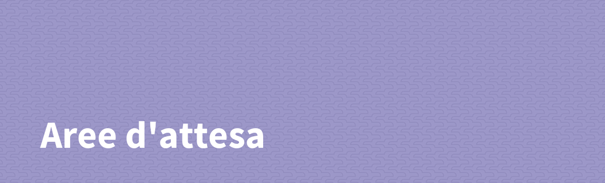

---
Progetto AR.js location based

### Miglioramenti apportati

- Riprogettazione totale del sito in TailwindCSS
- Fix del pull and refresh: l'overflow hidden impediva al pull and refresh di funzionare, è stato tolto di conseguenza dal body, al cui interno è stato aggiunto un container con overflow hidden
- Miglioramenti UX generali
- Aggiunta della navbar
- Aggiunta dell'home page
- Spostato l'a-scene in un iframe
- Aggiunto effetto quando si giunge in un'area
